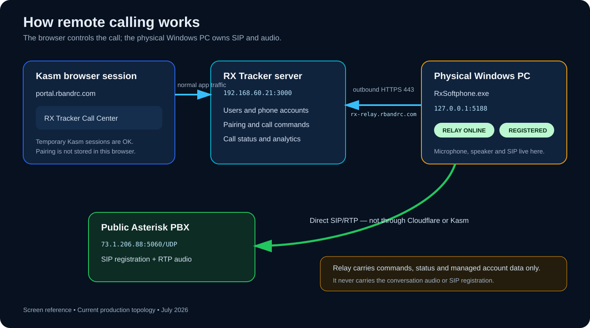
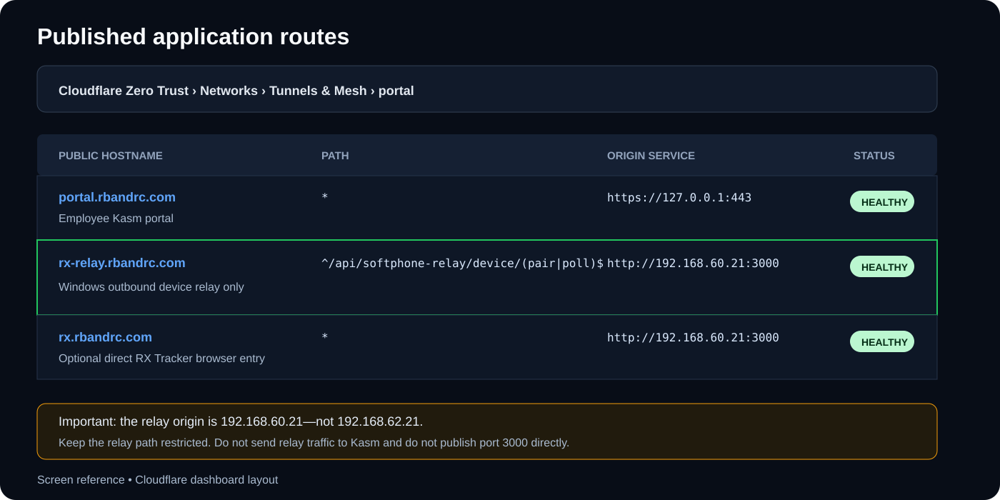
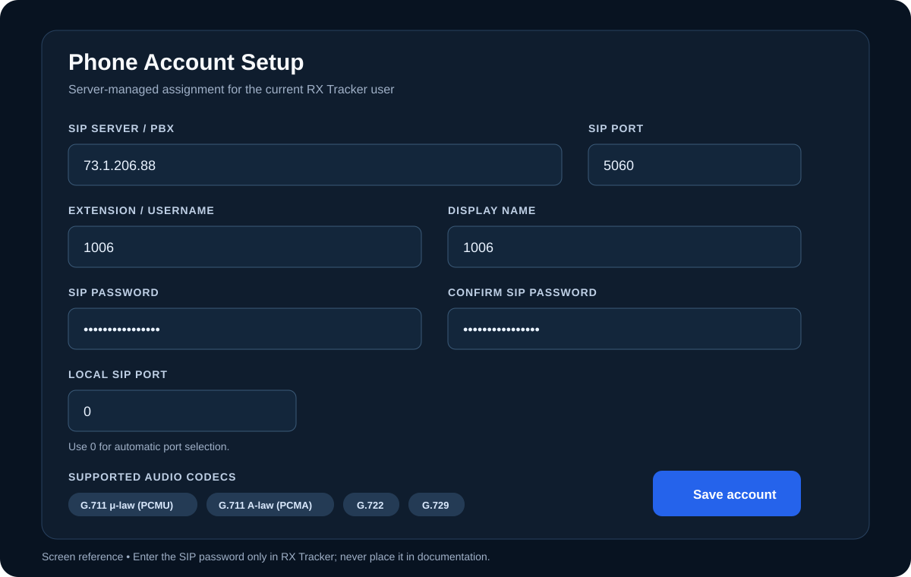
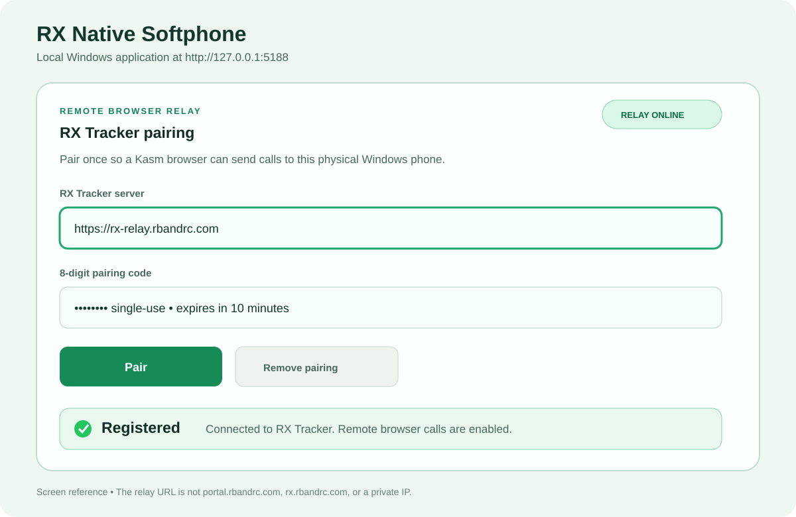
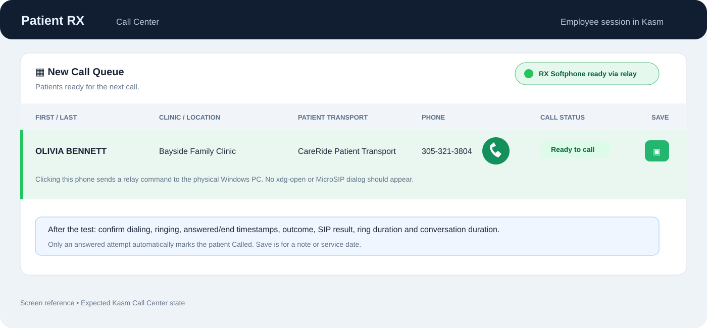
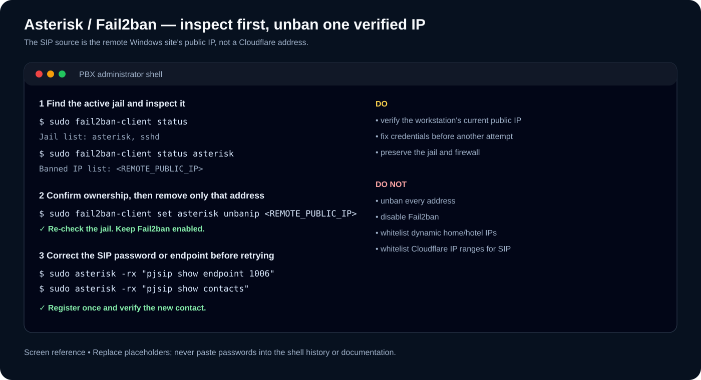

# Kasm + RX Softphone Remote Deployment Guide

**Applies to:** RX Tracker NEXT 4.0.0-next.11, RX Softphone 0.5.0, Windows 10/11 x64, Kasm at `https://portal.rbandrc.com`, and an Asterisk/Grandstream UCM PBX

**Current relay:** `https://rx-relay.rbandrc.com`
**Last verified:** July 22, 2026

This is the administrator runbook for preparing a remote Windows calling computer, configuring its RX Tracker user, pairing RX Softphone through the outbound relay, validating a call, and safely diagnosing Asterisk or Fail2ban problems.

> **Never put a SIP password, pairing token, encryption key, relay secret, or administrator PIN in this document, a ticket, or a screenshot.** Pairing codes are single-use, but they should still be treated as temporary secrets.

The drawings below are screen references based on the current interfaces. They are not photographs of a particular employee's account.

## 1. Understand what connects to what



There are two independent connections:

1. The employee uses a browser inside Kasm at `https://portal.rbandrc.com` to operate RX Tracker.
2. `RxSoftphone.exe` runs on the employee's physical Windows PC. It makes an outbound HTTPS connection to `https://rx-relay.rbandrc.com` for dial commands and call status, and it connects directly to the public PBX for SIP and RTP audio.

The relay does **not** carry audio, SIP registration, or RTP. Kasm is not bypassed for the employee's RX Tracker screen. Only the small command/status path avoids the remote browser so the physical PC can use its microphone, speaker, and PBX connection.

### Current production addresses

| Purpose | Address | Notes |
|---|---|---|
| Employee Kasm portal | `https://portal.rbandrc.com` | Normal employee entry point |
| Windows outbound relay | `https://rx-relay.rbandrc.com` | Enter this in RX Softphone |
| Direct RX Tracker website | `https://rx.rbandrc.com` | Administrative/direct-browser option; not the relay URL |
| RX Tracker origin | `http://192.168.60.21:3000` | Server-side tunnel destination; do not enter on remote PCs |
| Test Asterisk PBX | `73.1.206.88:5060/UDP` | Replace when the production provider is ready |

The old addresses `192.168.62.21`, `192.168.15.87:3100`, and a remote PC's own LAN address are **not** valid relay server values.

Employees should continue entering through `portal.rbandrc.com`. Opening `rx.rbandrc.com` directly bypasses the Kasm browser layer and should be limited to the approved direct-browser use case.

## 2. Required preparation

### RX Tracker server

Preserve these production `.env` values during every server deployment:

```dotenv
APP_ORIGINS=https://rx.camperos.net:10443,https://portal.rbandrc.com,http://192.168.60.21:3000,https://rx.rbandrc.com
SOFTPHONE_CREDENTIAL_KEY=<stable-random-secret>
SOFTPHONE_RELAY_SECRET=<different-stable-random-secret>
SOFTPHONE_ACCOUNT_ADMIN_PIN=<administrator-only-pin>
```

- Do not change `SOFTPHONE_CREDENTIAL_KEY` unless every saved SIP password will be entered again.
- Changing `SOFTPHONE_RELAY_SECRET` invalidates existing workstation pairings.
- The PIN protects server-side phone-account saves. It is not the SIP password and is not entered into RX Softphone.
- Deploy the server package without replacing the production `.env`.

In **Backoffice > Settings**, set **Call Center Phone Client** to **RX Softphone** and save.

### Cloudflare Tunnel

One existing `cloudflared` tunnel can publish all three hostnames. A second tunnel is not required.



Verify the published application routes exactly:

| Hostname | Path | Origin service |
|---|---|---|
| `portal.rbandrc.com` | `*` | `https://127.0.0.1:443` |
| `rx-relay.rbandrc.com` | `^/api/softphone-relay/device/(pair\|poll)$` | `http://192.168.60.21:3000` |
| `rx.rbandrc.com` | `*` | `http://192.168.60.21:3000` |

Copy the relay path as this exact regular expression:

```regex
^/api/softphone-relay/device/(pair|poll)$
```

Important rules:

- Keep the relay path restricted to `pair` and `poll`. Do not publish the full RX Tracker application under the relay hostname.
- The Windows client does not complete an interactive Cloudflare Access login. Do not put an interactive sign-in challenge in front of these two device endpoints. RX Tracker protects them with the one-time pairing code, hashed device token, rate limiting, and device authentication.
- Do not point the relay at the Kasm service. It must reach RX Tracker at `192.168.60.21:3000`.
- Do not expose port 3000 directly on the Internet; `cloudflared` reaches it over the internal network.

From any Internet-connected test PC, verify DNS:

```powershell
nslookup rx-relay.rbandrc.com 1.1.1.1
```

The hostname should resolve to Cloudflare addresses. A protected empty poll should reach RX Tracker and return `401`, not `404`, `502`, or a browser login page:

```powershell
Invoke-WebRequest `
  -Uri 'https://rx-relay.rbandrc.com/api/softphone-relay/device/poll' `
  -Method Post `
  -ContentType 'application/json' `
  -Body '{}'
```

Expected result: HTTP `401` with a message that a valid relay device token is required. That is a successful infrastructure test.

### Public Asterisk PBX

Before installing the workstation, confirm:

- The PBX has a stable public IP or DNS name.
- SIP UDP `5060` reaches Asterisk from the approved remote networks.
- The configured Asterisk RTP range is forwarded and allowed in both directions.
- The endpoint uses a strong, unique password. Do not use the extension number as the password.
- If Asterisk is behind NAT, its PJSIP transport has correct `local_net`, `external_signaling_address`, and `external_media_address` values.
- If extension `1006` will be registered by several computers, its PJSIP AoR permits enough contacts and does not remove the first contact unexpectedly.

For two computers using the same extension, the PBX administrator should verify something equivalent to:

```ini
[1006]
type=aor
max_contacts=2
remove_existing=no
```

This example is not a complete endpoint configuration. The provider, trunk, and dial plan must also permit the required number of simultaneous calls.

## 3. Prepare the remote Windows computer

The physical Windows computer needs:

- Windows 10 or 11 x64 with a persistent Windows user profile.
- A working headset or microphone and speakers.
- The approved `RxSoftphone-0.5.0-win-x64.zip` package.
- Outbound TCP `443` to `rx-relay.rbandrc.com`.
- Direct SIP/RTP reachability to the public PBX.
- Power settings that do not sleep during the calling shift.

It does **not** need Kasm Server, `cloudflared`, RX Tracker Server, Node.js, .NET installation, an inbound firewall opening, or port 3000.

### Install

1. Sign in to Windows with workstation-administrator approval, then install for the employee's persistent Windows profile.
2. Create `C:\Program Files\RX Softphone` so a standard Call Center user cannot replace `appsettings.json` or the executable.
3. Extract the **entire** ZIP into that folder. Do not run it from inside the ZIP and do not grant the Call Center user write permission to the installation folder.
4. Close MicroSIP during RX Softphone testing.
5. Start `C:\Program Files\RX Softphone\RxSoftphone.exe`, or double-click `Start-Softphone.cmd`, as the employee's normal persistent Windows user.
6. Open `http://127.0.0.1:5188` in a browser on that physical PC.

If the local page does not open:

```powershell
Get-Process RxSoftphone -ErrorAction SilentlyContinue
Get-NetTCPConnection -LocalPort 5188 -State Listen -ErrorAction SilentlyContinue
```

### Start automatically after Windows sign-in

1. Press `Win+R`.
2. Enter `shell:startup` and press Enter.
3. Place a shortcut to `C:\Program Files\RX Softphone\Start-Softphone.cmd` in the Startup folder.
4. Restart Windows once and confirm `http://127.0.0.1:5188` opens.

Sleep/wake and application restarts normally retain pairing because it is protected in the persistent Windows user profile. Re-pair only if the RX user changes, an administrator replaces the pairing, the Windows profile is rebuilt, or the saved pairing is removed.

## 4. Configure the user's server-managed phone account

Do this before generating the pairing code.

1. Sign in to RX Tracker as an Administrator.
2. Open **Administration > Users**.
3. Find the exact RX Tracker user and select **Allow setup**.
4. Sign in as that user and open **Phone Account Setup**.
5. Enter the assigned values and save with the administrator PIN when prompted.



For the current public-PBX test:

| Field | Value |
|---|---|
| SIP server / PBX | `73.1.206.88` |
| SIP port | `5060` |
| Extension / username | `1006` |
| Authentication ID | Leave blank unless the PBX AuthID / MicroSIP Login differs from the extension |
| Display name | `1006` or the approved label |
| SIP password | Enter the current secret; do not record it here |
| Confirm SIP password | Enter the same secret |
| Local SIP port | `0` for automatic selection |

The user's setup link closes after a successful save. An Administrator must explicitly allow setup again before the server-side assignment can be changed.

For a Grandstream UCM account where the extension is `3051` but the UCM **AuthID** is a different value, enter `3051` under **Extension / username** and enter the UCM AuthID under **Authentication ID**. The SIP/IAX password remains the separate secret in the password fields. Do not put the AuthID in the extension field.

## 5. Pair RX Softphone with the same RX Tracker user

The pairing belongs to the RX Tracker user and the physical Windows profile—not to the temporary Kasm session.

One RX Tracker user has one active paired relay device at a time. Pairing that same user on a second Windows computer replaces the first pairing. Different RX users may use different computers while sharing the same SIP extension only when the PBX is deliberately configured for multiple contacts and simultaneous calls.

### Generate the code in Kasm

1. In Kasm, open `https://portal.rbandrc.com`.
2. Sign in to RX Tracker as the user whose phone account was configured.
3. Open **Call Center**.
4. Select **Pair Windows phone**.
5. Select **Generate new code**.
6. Keep the eight-digit code private. It can be used once and expires after 10 minutes.

### Enter it on the physical Windows PC

1. Open `http://127.0.0.1:5188` on the physical Windows computer.
2. Under **RX Tracker pairing**, enter:
   - **RX Tracker server:** `https://rx-relay.rbandrc.com`
   - **8-digit pairing code:** the new code shown in Kasm
3. Select **Pair**.
4. Wait for **RELAY ONLINE** and **Registered**.



Do not enter any of these values in the relay field:

- `https://portal.rbandrc.com`
- `https://rx.rbandrc.com`
- `http://192.168.60.21:3000`
- the remote PC's local IP
- `http://127.0.0.1:5188`

After pairing, return to Kasm and hard-refresh Call Center with `Ctrl+Shift+R`.

## 6. Verify a complete call



Use this order for the first test:

1. Local RX Softphone shows **RELAY ONLINE**.
2. Local RX Softphone shows **Registered**.
3. Kasm Call Center shows **RX Softphone ready via relay**.
4. Select a green patient phone icon.
5. Confirm the physical Windows phone dials without an `xdg-open` or MicroSIP popup in Kasm.
6. Confirm local ringback.
7. Answer the destination and verify two-way audio.
8. Confirm the connected-call timer advances.
9. Hang up from the visible Call Center control or the local RX Softphone.
10. Confirm the call attempt automatically records dialing, ringing, answered/end times, outcome, SIP reason, ring duration, and conversation duration.

Expected record behavior:

- **Answered:** automatically counts as Called.
- **No answer, busy, rejected, unavailable, cancelled, or failed:** remains in attempt history but does not automatically mark the patient Called.
- **Save button:** saves the user's note or service date; it is not required to create the automatic call-attempt record.

## 7. Fail2ban and Asterisk recovery

Repeated tests with a wrong SIP password can legitimately trigger the Asterisk Fail2ban jail. The address Fail2ban sees is normally the **remote Windows site's public IP**, because SIP travels directly from RX Softphone to the PBX. It is not the Cloudflare relay IP.



### Find the correct remote public IP

On the remote Windows PC, obtain its current public IPv4 address from the organization's approved IP-check service. Record it temporarily as `<REMOTE_PUBLIC_IP>`.

Do not assume the IP remains the same after changing Wi-Fi, ISP, VPN, hotspot, or router.

### Inspect before changing anything

On the Asterisk Linux server:

```bash
sudo systemctl status fail2ban --no-pager
sudo fail2ban-client status
sudo fail2ban-client status asterisk
```

If the jail is not named `asterisk`, use the exact name listed by the first `status` command.

Also inspect Asterisk:

```bash
sudo asterisk -rx "pjsip show endpoint 1006"
sudo asterisk -rx "pjsip show contacts"
sudo tail -n 100 /var/log/asterisk/full
sudo journalctl -u fail2ban -n 100 --no-pager
```

### Safely unban one verified address

Only after confirming that the address belongs to the authorized test workstation:

```bash
sudo fail2ban-client set asterisk unbanip <REMOTE_PUBLIC_IP>
sudo fail2ban-client status asterisk
```

Then correct the SIP password/configuration **before** pressing Register again. Otherwise the same address will be banned again.

Do not use `fail2ban-client unban --all`, stop Fail2ban, flush the firewall, or disable the Asterisk jail merely to make a phone register.

### Whitelisting policy

Do not permanently whitelist ordinary home, hotel, mobile, or dynamic ISP addresses. If an office has a controlled, static public IP and the security administrator approves it, add only that exact `/32` in a local override file while preserving the distribution's existing Asterisk jail settings:

```ini
# /etc/fail2ban/jail.d/asterisk.local
[asterisk]
ignoreip = 127.0.0.1/8 ::1 <TRUSTED_STATIC_OFFICE_IP>/32
```

Validate before applying:

```bash
sudo fail2ban-client -t
sudo fail2ban-client reload asterisk
sudo fail2ban-client status asterisk
```

If the installed Fail2ban version does not accept a jail name after `reload`, use `sudo fail2ban-client reload` after the configuration test succeeds.

Do not add Cloudflare IP ranges to the Asterisk jail allowlist. Cloudflare carries HTTPS relay traffic only; it is not the SIP client.

### If registration still fails after unban

Follow this order:

1. Confirm RX Softphone has the correct public PBX address, extension, and current password from RX Tracker.
2. Confirm `<REMOTE_PUBLIC_IP>` is no longer in the Fail2ban jail.
3. Confirm UDP 5060 reaches the PBX firewall/NAT rule.
4. Confirm extension `1006` exists and its authentication object is correct.
5. Confirm the AoR is not at its contact limit.
6. Confirm the provider/cloud firewall, `nftables`, or `iptables` is not separately blocking the address.
7. Enable PJSIP logging only for the short diagnostic window:

```bash
sudo asterisk -rvvv
pjsip set logger on
# Perform one registration attempt, inspect the result, then immediately:
pjsip set logger off
exit
```

Do not distribute SIP traces; they contain sensitive addressing and account metadata.

## 8. Troubleshooting by symptom

| Symptom | Most likely cause | What to do |
|---|---|---|
| Local page `127.0.0.1:5188` does not open | RX Softphone is not running | Start the EXE; verify process and listening port |
| Pair returns 404 | Wrong relay hostname/path or Cloudflare route | Use `https://rx-relay.rbandrc.com`; check exact route regex |
| Pair returns 502 | Tunnel connector cannot reach RX Tracker | Verify tunnel health and `http://192.168.60.21:3000/api/healthz` from the connector host |
| Pair shows Cloudflare sign-in/403 | Interactive Access policy intercepts device endpoint | Exempt only the restricted device route or use a supported noninteractive policy |
| `RELAY ONLINE`, but not Registered | Saved phone account, PBX reachability, password, or Fail2ban problem | Re-check sections 4 and 7 |
| Kasm says offline while local relay is online | Different RX user, stale Kasm page, or old pairing | Sign in as the paired user and hard-refresh; pair again only if necessary |
| Clicking phone opens `xdg-open` | Backoffice is set to MicroSIP or page is stale | Set RX Softphone in Backoffice and hard-refresh |
| Phone dials but there is no audio | RTP/NAT/firewall issue | Verify RTP range, external media address, and two-way firewall rules |
| One-way audio | Incorrect public/private SDP address or asymmetric NAT | Verify Asterisk NAT transport and endpoint media settings |
| Second computer unregisters the first | AoR contact limit/removal policy | Increase `max_contacts`; review `remove_existing` |
| Repeated immediate bans | Wrong password or aggressive retries | Stop retries, correct credentials, then unban the verified public IP once |
| Pairing disappeared after Windows restart | Different Windows profile or local pairing data removed | Start under the original persistent user; otherwise pair again |

## 9. Managed workstation and tray behavior in 0.5.0

Version 0.5.0 is managed by RX Tracker by default and runs in the Windows notification area:

- RX Tracker supplies the assigned PBX server, port, extension, display name, local port, and transient SIP password.
- The colored tray icon and menu show registration, relay state, current call state/duration, and the last call number/outcome/duration without keeping the browser open.
- The tray provides Open, Hang Up, managed Disable/Enable, and Exit. Managed Unpair is visible but disabled and directs the user to an Administrator.
- PBX/account fields are read-only, and local Register, Unregister, and Remove pairing operations are rejected by the loopback API as well as hidden in the page.
- Manual dialing remains available so the local phone can be tested without changing its account.
- An Administrator uses the user's one-time **Phone Account Setup** authorization to correct an account and **Administration > Phone Devices** to inspect versions, registration, synchronization, last heartbeat, and pairing.
- Administrators can revoke an idle device. Revocation expires pending commands, invalidates the token, and causes the client to clear its pairing and registration on its next poll. End an active call first.
- A permanent SIP authentication failure stops the rejected credential cycle. Correct the server assignment; do not keep retrying or disable Fail2ban.

The distributed `appsettings.json` must keep `Softphone:ManagedMode` set to `true`. Install the package under an administrator-controlled location such as `C:\Program Files\RX Softphone` when Call Center users are standard Windows users. A Windows local administrator can replace application files or configuration and therefore remains a trusted workstation administrator.

### Updating the workstation package

1. End the active call and close RX Softphone.
2. Keep a recoverable copy of the current `C:\Program Files\RX Softphone` folder.
3. Extract the entire approved replacement package into a new permanent folder.
4. Start the replacement under the same Windows user and verify its version and local page.
5. Confirm **RELAY ONLINE** and **Registered**. Pair again only if the saved pairing was not retained.
6. Complete one answered and one pre-answer-cancelled call test before removing the previous folder.

Do not deploy below 0.5.0 for the current managed workstation experience. Version 0.4.4 has stable calling but requires a persistent CMD process instead of the status-aware tray. Version 0.4.3 can register with a distinct Authentication ID but may end its authenticated outbound call immediately after answer.

## 10. Administrator acceptance checklist

### Infrastructure

- [ ] `portal.rbandrc.com` opens Kasm.
- [ ] `rx-relay.rbandrc.com` resolves publicly.
- [ ] Empty relay poll reaches RX Tracker and returns expected `401`.
- [ ] Tunnel route uses the exact restricted device path and `192.168.60.21:3000`.
- [ ] RX Tracker Backoffice phone client is **RX Softphone**.
- [ ] Production `.env` secrets are backed up and unchanged.

### Workstation

- [ ] Entire 0.5.0 ZIP is extracted to an administrator-controlled permanent folder.
- [ ] RX Softphone starts under the employee's persistent Windows user.
- [ ] No CMD window remains open; the RX Softphone tray icon remains visible.
- [ ] Tray status shows registration, relay, no active call, and the most recent test call.
- [ ] Startup shortcut is tested after a Windows restart.
- [ ] Local page opens at `127.0.0.1:5188`.
- [ ] Relay field is exactly `https://rx-relay.rbandrc.com`.
- [ ] Status shows **RELAY ONLINE** and **Registered**.
- [ ] Local PBX fields and Register/Unregister/Remove pairing are locked.

### Call and security

- [ ] Kasm shows **RX Softphone ready via relay**.
- [ ] Answered call has two-way audio and correct automatic telemetry.
- [ ] Cancelled/no-answer test does not mark patient Called.
- [ ] Remote site's public IP is not banned by Fail2ban.
- [ ] Fail2ban remains enabled.
- [ ] SIP password is not present in notes, screenshots, or this checklist.
- [ ] Administrator can see version 0.5.0, managed status, and synchronized account in **Phone Devices**.

### Acceptance record

| Item | Result |
|---|---|
| Windows computer / employee | `____________________________` |
| RX Tracker username | `____________________________` |
| PBX / extension | `____________________________` |
| Remote public IP during test | `____________________________` |
| Relay online | `Yes / No` |
| Registered | `Yes / No` |
| Answered two-way call | `Yes / No` |
| Automatic telemetry | `Yes / No` |
| Fail2ban checked | `Yes / No` |
| Administrator / date | `____________________________` |

## 11. Authoritative references

- [Cloudflare: Published applications](https://developers.cloudflare.com/cloudflare-one/networks/connectors/cloudflare-tunnel/routing-to-tunnel/)
- [Cloudflare: Tunnel routing and supported services](https://developers.cloudflare.com/tunnel/routing/)
- [Asterisk: Important Security Considerations](https://docs.asterisk.org/Deployment/Important-Security-Considerations/)
- [Asterisk: Configuring `res_pjsip` through NAT](https://docs.asterisk.org/Configuration/Channel-Drivers/SIP/Configuring-res_pjsip/Configuring-res_pjsip-to-work-through-NAT/)
- [Asterisk: PJSIP troubleshooting guide](https://docs.asterisk.org/Configuration/Channel-Drivers/SIP/Configuring-res_pjsip/Asterisk-PJSIP-Troubleshooting-Guide/)
- [Asterisk: `res_pjsip` configuration reference](https://docs.asterisk.org/Latest_API/API_Documentation/Module_Configuration/res_pjsip/)
- [Fail2ban: Official jail configuration reference](https://github.com/fail2ban/fail2ban/blob/master/config/jail.conf)
- [Fail2ban: Official command change log, including `unbanip`](https://github.com/fail2ban/fail2ban/blob/master/ChangeLog)
